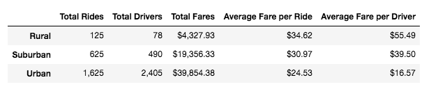
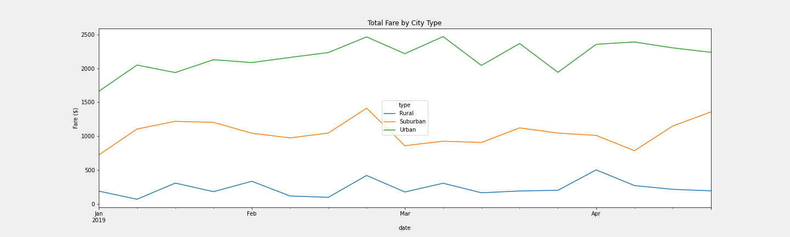

# PyBer_Analysis
Matlplotlib-Module5
## Overview
This report is on the exploratory data analysis performed for the ride-sharing mobile app company PyBer. The report consists of the analysis of ride-sharing data by city type and the weekly fare by city type. The aim of the analysis is to provide PyBer with meaningful outcomes to help the management improve access to ride-sharing services, and to determine affordability for underserved neighborhoods. Visualizations and summary tables are included in the report to enhance the explanatory power of the report.

## Results

* The table below displays the relationship between ride-sharing data by city type, namely Rural, Suburban and Urban. 

* The results indicate that the total number of rides and drivers and total cost of fares is the highest in the urban cities, while it is the lowest in the rural cities. Suburban cities is the second highest.
* When we compare the number of total rides in urban cities and the rural cities, we notice that the total number of rides in urban cities (1,625) is 13 times as much as the rural cities (125). The number of rides in the urban cities is also much higher compared to the suburban cities--total number rides in the urban cities is nearly 3 times as the suburban rides. The suburban rides on the other hand, is 5 times greater than in the rural cities. 
* When we compare the total number of drivers in urban and rural cities, we notice that the difference is much greater--30 times higher in urban cities. Total number of drivers in the suburban cities is 6 times greater than the rural cities.
* The amount of total fares collected by urban cities is nearly 10 times greater compared to the rural cities.
* However, the average fare per ride and the average fare per driver is the highest for rural cities, while it is lowest for the urban cities. 
* The graph below shows the total weekly fares for each city type.

* The graphs for each city type shows that the total weekly fare does not fluctutate drastically between January and May, with several peaks especially in the urban cities graph.

## Summary

* The results of the ride-sharing data analysis show significant differences between urban, suburban and rural areas. 
* The difference in the number of drivers dedicated to the urban cities compared to the rural cities is much more than the difference in the number to the number of rides between these city types-13 times (difference in the number of rides) compared to 30 times (difference in the number of drivers).
* This could be an indication of potential higher demand in the rural area if more drivers were available.
* However, it is premature to suggest any adjustments made to the number of drivers allocated to the city types before performing a demand analysis.
* If a higher demand is determined as a result of the analysis then PyBer could consider increasing the number of drivers in the rural areas.
* If a higher market demand is determined this will also potentially mean higher revenue for Pyber as the average fare per ride and per driver is much higher in the rural cities. This could be due to the relatively longer distances travelled. 
